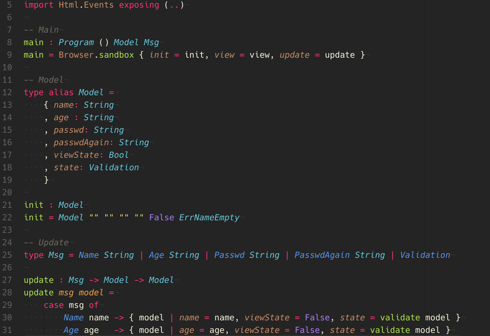

# Elm Language support in Atom

Adds syntax highlighting to Elm files in Atom using the [tree-sitter-elm](https://github.com/Razzeee/tree-sitter-elm) package.

## Install on any platform
```sh
apm install language-elm-treesitter
```

Or in the install tab on Atom editor

## Contributions
Contributions are greatly appreciated. Please fork this repository and open a pull request to add snippets, make grammar tweaks, etc.

## Example
**Example using [monokai-grayjack-syntax](https://atom.io/themes/monokai-grayjack-syntax)**

